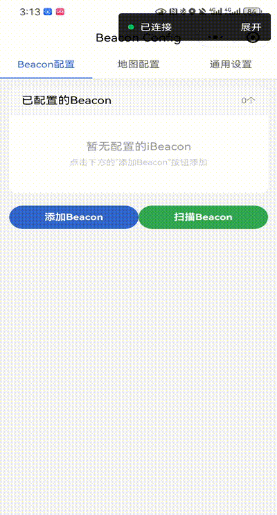
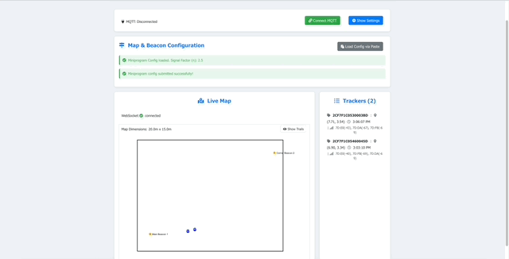

# Multi-Tracker Beacon Positioning System (Version 0.1)

This project provides a system for real-time indoor tracking of multiple devices (trackers) using Bluetooth Low Energy (BLE) beacon signals. It visualizes their calculated positions on a dynamic, web-based map. It is designed to work with iBeacon-compatible devices and has specific support for SenseCAP T1000 trackers by matching MAC addresses and parsing their MQTT data format.

## Overview: What Does This Project Do?

The primary goal of this system is to determine and display the location of multiple trackers within a defined indoor area. It achieves this by:

1.  **Receiving Beacon Data:** A backend server listens to an MQTT broker for messages containing beacon scan data from tracker devices (e.g., RSSI, beacon identifiers).
2.  **Configuration:**
    *   **Map & Beacons:** Users define the physical layout of the indoor space and the precise locations (x, y coordinates) of reference beacons using a Miniprogram tool. This configuration also includes beacon MAC addresses (crucial for trackers like SenseCAP that don\'t use standard iBeacon UUID/Major/Minor for identification in this context) and their signal characteristics (TxPower).
    *   **Server & MQTT:** Users configure MQTT broker details and server operational parameters via a web UI.
3.  **Position Calculation:** The backend server uses the received signal strength (RSSI) from multiple beacons and their known locations to calculate the tracker\'s position via trilateration.
4.  **Position Smoothing:** A Kalman filter is applied to smooth the calculated positions, reducing jitter and improving accuracy.
5.  **Real-time Visualization:** A web-based frontend displays the map, beacon locations, and the live, smoothed positions of all active trackers. Tracker movements can also be visualized as trails.
6.  **Data Communication:** The backend communicates with the frontend using WebSockets for real-time updates.

The system is composed of three main components:
*   **Backend Server (`server/`):** Python (FastAPI) based, handles MQTT, position calculation, state management, and serves the API and WebSocket.
*   **Web Frontend (`web/`):** Vue 3 and Vite based, provides the user interface for configuration, map display, and tracker visualization.
*   **Miniprogram Configuration Tool (`miniprogram/`):** A Weixin (WeChat) Mini Program for easy map and beacon setup on a mobile device. This tool allows you to:
    *   Upload a map image.
    *   Scan for nearby iBeacons (via specified UUIDs for iOS, or general scan for Android).
    *   Manually input beacon details.
    *   **Crucially, for each beacon, you must ensure the "MAC Address / Device ID" field is correctly populated.**
        *   For Android-scanned beacons, this might be pre-filled.
        *   **For beacons found via iOS scans (which do not provide MAC addresses) or those added manually, you MUST enter the beacon's actual MAC address (or a unique identifier that your backend will use for matching, especially for trackers like SenseCAP).** This is vital for the backend to correctly identify which physical beacon corresponds to the signals received from trackers.
    *   Place beacons on the map (x, y coordinates).
    *   Configure the signal propagation factor (n).
    *   Export the entire configuration as a JSON string.

## Key Features in v0.1

*   Real-time tracking of multiple devices.
*   Support for iBeacon-like signals and MAC-address based beacon identification (e.g., SenseCAP).
*   Web-based UI for configuration and visualization.
*   Trilateration-based positioning with Kalman filter smoothing.
*   Configurable map layouts and beacon placements via a Miniprogram tool or JSON paste.
*   MQTT integration for receiving tracker data.
*   WebSocket communication for live updates to the frontend.
*   Display of tracker movement trails on the map (toggleable).

## Quick Demonstration

Here's a glimpse of the system in action:

**1. Configuring Beacons with the Miniprogram Tool:**

This shows a brief example of how the Weixin Miniprogram tool is used to set up beacon locations and parameters.



**2. Live Tracking on the Web Interface:**

This demonstrates the web application displaying live tracker movements on the configured map.



## Architecture & Data Flow

```
+--------------------------+     +-------------------------+      +-----------------+
| Tracker Device           | --> | MQTT Broker             | M--> | Backend Server  |
| (e.g., SenseCAP T1000)   |     | (e.g., Seeed\'s SenseCAP | Q--> | (FastAPI)       |-----> WebSocket
| - Scans Beacons          |     |  OpenStream, or other)  | T--> | - Receives Reports  |
| - Publishes to MQTT topic|     +-------------------------+ T    | - Calculates Pos    |<---+ (Frontend UI)
+--------------------------+                                     | - Manages State     |
                                                                 | - Serves Config/API |
                                                                 +---------|---------+
                                                                           | (HTTP API for Config)
       +-----------------------+      +------------------------+           |
       | Weixin Mini Program   | ---> | User copies JSON to    | --------->|
       | (Configuration Tool)  |      | Web UI Paste Area      |           |
       | - Configure Map       |      +------------------------+           |
       | - Configure Beacons   |                                           |
       | - Export Config JSON  |                                           |
       +-----------------------+                                           V
                                                                 +-----------------+\\
                                                                 | Web Frontend    |
                                                                 | (Vue 3)         |
                                                                 | - Config Mgmt   |
                                                                 | - Displays Map  |
                                                                 | - Shows Trackers|
                                                                 +-----------------+
```

**Data Flow Summary:**
1.  **Configuration:**
    *   **Map & Beacons:** Use the Miniprogram tool to define the map layout, beacon locations, and MAC addresses. Export the configuration as JSON.
    *   **Server Runtime:** In the Web Frontend ("Show Settings"), configure MQTT broker details, server port, and Kalman parameters. This creates/updates `server/server_runtime_config.json`.
2.  **Load Map & Beacon Config:** In the Web Frontend, paste the JSON from the Miniprogram into the "Map & Beacon Configuration" section. This updates `server/miniprogram_config.json`.
3.  **Connect MQTT:** In the Web Frontend, click "Connect MQTT." The backend subscribes to the MQTT topic defined in `server_runtime_config.json`.
4.  **Tracker Data Transmission:** Trackers publish beacon scan data (MAC addresses, RSSI) to the MQTT topic. The backend specifically listens for SenseCAP messages with `MeasurementID == "5002"`.
5.  **Position Calculation & Smoothing:** The Backend calculates the tracker\'s position and applies a Kalman filter.
6.  **Visualization:** The Backend broadcasts position and state updates via WebSocket to the Web Frontend, which displays trackers on the map.

## Setup: Getting Started

Follow these steps to set up and run the system.

**Prerequisites:**

*   **Node.js:** Latest LTS version (e.g., 18.x, 20.x) recommended for the Vue frontend. Download from [nodejs.org](https://nodejs.org/).
*   **npm:** Included with Node.js.
*   **Python:** Version 3.10 or newer is recommended. Download from [python.org](https://www.python.org/).
*   **uv (Recommended) or pip:** For Python package management.
    *   `uv` is a fast Python package installer and resolver. Installation instructions: [uv documentation](https://github.com/astral-sh/uv#installation).
    *   `pip` is the standard Python package installer, usually included with Python.
*   **Weixin Developer Tools:** Required for running and debugging the Miniprogram configuration tool (`miniprogram/`). Download from the official WeChat developer site.

**Important Note for iOS Beacon Scanning:**
To specify which iBeacon UUIDs the Miniprogram should scan for on iOS devices, you need to edit the `miniprogram/config/ble_scan_config.js` file. This file allows you to list multiple UUIDs. Example content:
```javascript
// miniprogram/config/ble_scan_config.js
const iOSScanUUIDs = [
  '74278BDA-B644-4520-8F0C-720EAF059935', // Default/Example UUID
  // 'YOUR-OTHER-BEACON-UUID-HERE' 
];
module.exports = { iOSScanUUIDs: iOSScanUUIDs };
```
Make sure to add the UUIDs of the beacons you intend to use.

**1. Backend Server Setup (Python):**

```bash
# 1. Navigate to the project root directory
# Example: cd /path/to/your/beacon_posistion_r1000

# 2. Create and activate a virtual environment (highly recommended)
python -m venv .venv

# On Linux/macOS:
source .venv/bin/activate

# On Windows (Command Prompt/PowerShell):
# .venv\\Scripts\\activate

# 3. Install Python dependencies:
# Using uv (recommended):
uv pip install -r server/requirements.txt 
# Or, if requirements.txt is outdated or for a cleaner install from project metadata:
# uv pip install .

# Using pip:
pip install -r server/requirements.txt
# Or, if requirements.txt is outdated or for a cleaner install from project metadata:
# pip install . 
# (Ensure your pip is upgraded: pip install --upgrade pip)
```
Note: The project uses `pyproject.toml` to define dependencies. `uv pip install .` or `pip install .` will use this file. `server/requirements.txt` should ideally be generated from `pyproject.toml`. An `__init__.py` file in the `server/` directory makes it a Python package.

**2. Web Frontend Setup (Vue.js):**

```bash
# 1. Navigate to the web directory
cd web

# 2. Install Node.js dependencies
npm install

# 3. (For Development) The frontend uses Vite. 
#    A proxy is configured in `web/vite.config.js` to forward API (`/api`) 
#    and WebSocket (`/ws`) requests to the backend during development.
```

**3. Miniprogram Tool Setup (Weixin/WeChat):**

*   Open Weixin Developer Tools.
*   Click "Import Project."
*   Select the `miniprogram/` directory from this project.
*   Assign an AppID (you can use a test AppID if you don\'t have a registered Mini Program).
*   The Mini Program allows you to upload a map image, scan for nearby iBeacons, manually input beacon details (including MAC addresses for non-iBeacon devices like SenseCAP), place beacons on the map, and configure the signal propagation factor (n).

## Configuration Files

The backend relies on two main JSON configuration files located in the `server/` directory:

1.  **`server/miniprogram_config.json`**
    *   **Purpose:** Defines the map layout, beacon locations (x, y coordinates), beacon identifiers (MAC address, display name, TxPower/reference RSSI), and the signal propagation factor (n).
    *   **Source:** Generated by the **Miniprogram Configuration Tool** and then pasted into the "Map & Beacon Configuration" section of the **Web Frontend UI**.
    *   **Example Snippet (conceptual):**
        ```json
        {
          "map": {
            "name": "Sample Map",
            "width": 20.0,
            "height": 15.0,
            // ... other map properties ...
            "entities": [ /* wall polylines, etc. */ ]
          },
          "beacons": [
            {
              "uuid": "74278BDA-B644-4520-8F0C-720EAF059935",
              "major": 10001,
              "minor": 19641,
              "x": 2.5,
              "y": 3.0,
              "txPower": -59, // Reference RSSI at 1m
              "displayName": "Entrance Beacon",
              "macAddress": "C3:00:00:3E:7D:DA" // CRITICAL: Must be the actual MAC or unique ID for backend matching.
                                               // Populated from "MAC Address / Device ID" field in Miniprogram.
                                               // If left blank in Miniprogram for an iOS-scanned/manual beacon, it will be an empty string here.
            }
            // ... more beacons
          ],
          "settings": {
            "signalPropagationFactor": 2.5
          }
        }
        ```
    *   A full example template can be viewed in the Web Frontend UI when loading the configuration.

2.  **`server/server_runtime_config.json`**
    *   **Purpose:** Defines MQTT broker connection details, the backend server port, and Kalman filter parameters.
    *   **Source:** Managed via the "Server Runtime Configuration" panel in the **Web Frontend UI**. It can also be created/edited manually on the server before the first run.
    *   **Example Structure:**
        ```json
        {
          "mqtt": {
            "brokerHost": "sensecap-openstream.seeed.cc",
            "brokerPort": 1883,
            "username": "org-YOUR_ORG_ID",
            "password": "YOUR_MQTT_PASSWORD",
            "applicationID": "YOUR_SEEED_ORG_ID", // Used in the topic pattern
            "topicPattern": "/device_sensor_data/{ApplicationID}/+/+/+/+", // For SenseCAP
            "clientID": "beacon_pos_sys_client_01", // Optional, but recommended for uniqueness
            "enabled": true // Note: Manual connection via UI is still primary trigger
          },
          "server": {
            "port": 8000 // Port for the FastAPI backend
          },
          "kalman": {
            "processVariance": 1.0,
            "measurementVariance": 10.0
          }
        }
        ```

## Running the System

1.  **Prepare Configuration Files:**
    *   **Server Runtime Config:** Ensure `server/server_runtime_config.json` exists and is correctly configured with your MQTT broker details and desired server port. You can create this file manually based on the example above, or configure it via the UI after starting the server and frontend for the first time.
    *   **Map & Beacon Config:** Have your map & beacon configuration JSON (exported from the miniprogram tool) ready to paste into the UI.

2.  **Start Backend Server:**
    *   Navigate to the project root directory.
    *   Activate your Python virtual environment (e.g., `source .venv/bin/activate`).
    *   Run the Uvicorn server:
    ```bash
    # IMPORTANT: Run WITHOUT --reload for stable MQTT and WebSocket operation.
    # Replace <your_configured_port> with the port in server_runtime_config.json (default 8022).
    uvicorn server.main:app --host 0.0.0.0 --port <your_configured_port>
    
    # Example using default port 8022:
    # uvicorn server.main:app --host 0.0.0.0 --port 8022

    # Or directly run with uv
    # uv run uvicorn server.main:app --host 0.0.0.0 --port 8022
    ```
    *   **Note on `--reload`**: Using Uvicorn\'s `--reload` flag can interfere with the Paho MQTT client\'s threading and WebSocket stability. For reliable operation, especially when using MQTT features, **run the server without `--reload`**. If you make backend code changes, a manual server restart is necessary.

3.  **Start Frontend Development Server:**
    *   Navigate to the `web/` directory.
    *   Run the Vite development server:
    ```bash
    cd web
    npm run dev
    ```
    *   Access the frontend in your browser, typically at `http://localhost:5173` (Vite will show the exact URL in the terminal).

4.  **Initial Setup via Web UI:**
    *   Open the Web Frontend in your browser.
    *   If `server_runtime_config.json` was not pre-configured, click "Show Settings," fill in your MQTT broker details, server port, and Kalman filter parameters, then save. The server will create/update the file.
    *   In the "Map & Beacon Configuration" panel, click "Load Config via Paste," paste the JSON from your miniprogram tool, and submit. The map and beacons should appear.
    *   In the top panel, click "Connect MQTT" to establish the connection to your MQTT broker.

5.  **View Results:**
    *   If trackers are publishing data to the configured MQTT topic (and matching `MeasurementID "5002"` for SenseCAP devices, using MAC addresses defined in your beacon config), they should appear on the live map and in the trackers list. You can toggle "Show Trails" on the map to see recent movement.

## Key Functionality & Files (for Developers)

*   **MQTT Data Parsing:** `server/main.py` (function `parse_sensecap_payload`) handles incoming SenseCAP MQTT messages. The `on_message` callback filters for `MeasurementID == "5002"`.
*   **Positioning Logic:** `server/positioning.py` contains distance calculation (RSSI to distance) and trilateration algorithms. Beacon matching relies on MAC addresses from `miniprogram_config.json`.
*   **Kalman Filter:** `server/positioning.py` (class `KalmanFilter2D`) provides 2D position smoothing.
*   **Configuration Management:** `server/config_manager.py` loads and saves the two primary JSON configuration files.
*   **State Management & WebSockets:** `server/main.py` (class `ConnectionManager` and `tracker_states` dictionary) manages tracker states and broadcasts updates via WebSockets.
*   **Frontend UI Components:**